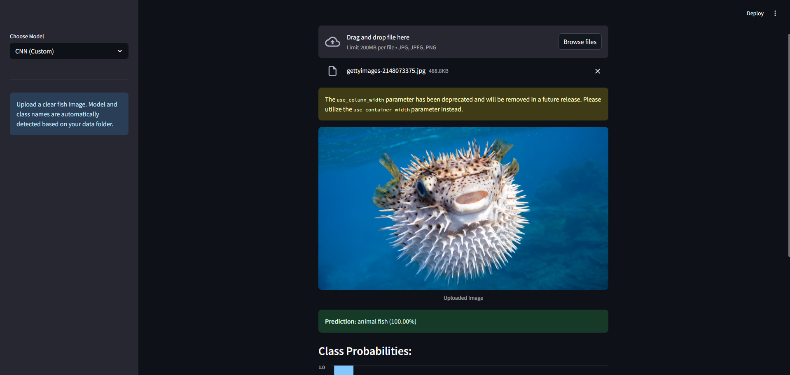
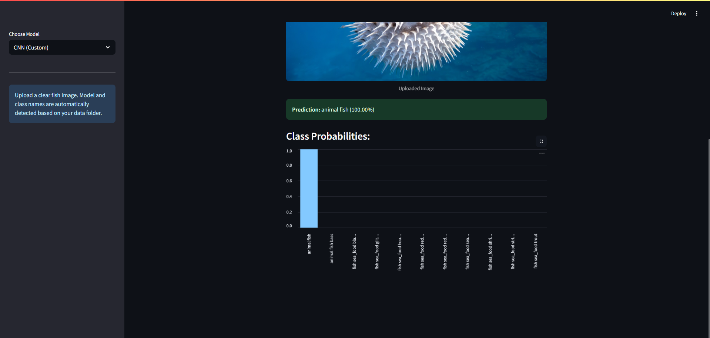
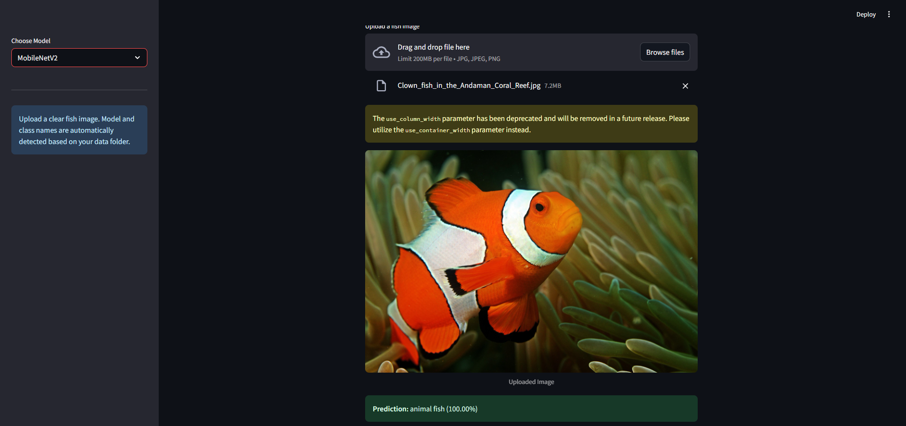

# Multiclass Fish Image Classification

A deep learning project to classify fish species from images using **Convolutional Neural Networks (CNN)** and **Transfer Learning** with models such as MobileNetV2.

---

## Project Overview

This project aims to classify fish images into multiple species using a combination of:

- **Custom CNN Model**  
- **Transfer Learning Models** (e.g., MobileNetV2, VGG16, ResNet50, etc.)

The application includes:
- Data preprocessing & augmentation
- Model training and evaluation
- Deployment via a Streamlit web application

---

## Objectives
- Build a robust fish classification model with high accuracy
- Compare custom CNN vs pretrained transfer learning models
- Deploy an easy-to-use web app where users can upload an image and get predictions

---

## Dataset
The dataset consists of images of various fish species organized into folders per class.

**Example Structure:**
Dataset/
  data/
    train/
      class_1/
      class_2/
      ...
    val/
      class_1/
      class_2/
      ...
    test/
      class_1/
      class_2/
      ...

---

## Features Implemented
- **Data Preprocessing & Augmentation**
  - Resizing images to `(224, 224)`
  - Normalizing pixel values
  - Applying rotation, zoom, shift, and horizontal flip
- **Model Training**
  - CNN from scratch
  - Transfer Learning with MobileNetV2 (and other models if enabled)
  - Fine-tuning support
- **Evaluation**
  - Accuracy, Precision, Recall, F1-Score
  - Confusion matrix
- **Deployment**
  - Streamlit app to upload images and view predictions with confidence scores

---

## How to Run

### 1. Install Requirements

### 2. Train the Model (Optional if using pre-trained model)
```bash
python train_model.py
```

### 3. Run the Streamlit App
```bash
streamlit run app.py
```

---

## Output Images

### Example Prediction Result



---

## Tech Stack
- **Python**
- **TensorFlow / Keras**
- **Streamlit**
- **Pillow**
- **NumPy**
- **Matplotlib**
- **scikit-learn**

---

## Author
- **S BHAVISH**  

---

## License
This project is licensed under the MIT License - see the LICENSE file for details.
